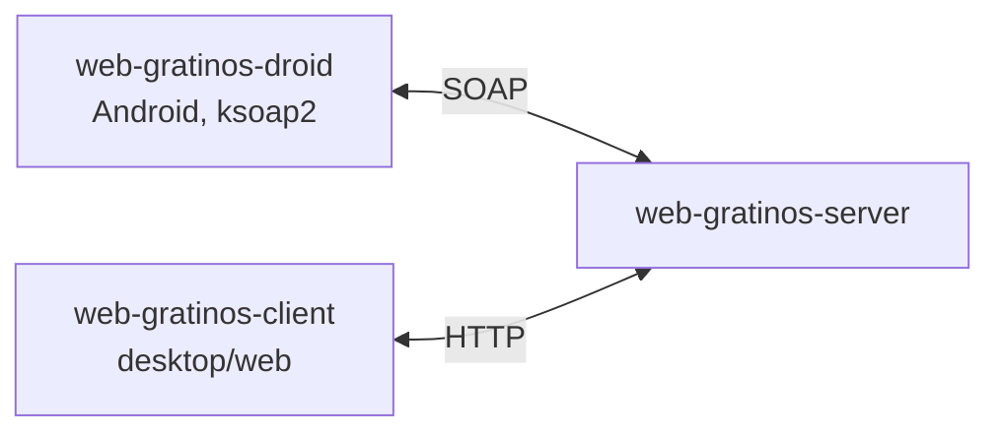

# web-gratinos

Define a web service giving only a boolean answering to the question "is there some gratin dauphinois in the fridge?" \
Android app is given to fetch info from the web service.

## Architecture



## Project structure

This is a multi-module Maven project, made of three modules:

| Module | Role |
|---|---|
| `web-gratinos-server` | Backend / server-side module |
| `web-gratinos-client` | Client application |
| `web-gratinos-droid` | Android client |

## Main Tech stack

- **Java 8** (`maven-compiler-plugin` targets `1.8`)
- **ksoap2-android** (`com.google.code.ksoap2-android`, v3.6.1)

## Build

From the repository root:

```bash
mvn clean install
```

This builds all three modules (`web-gratinos-server`, `web-gratinos-client`, `web-gratinos-droid`) in order.
